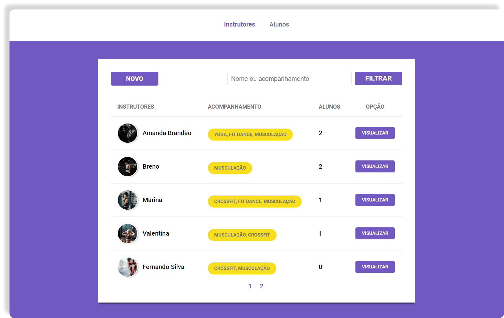
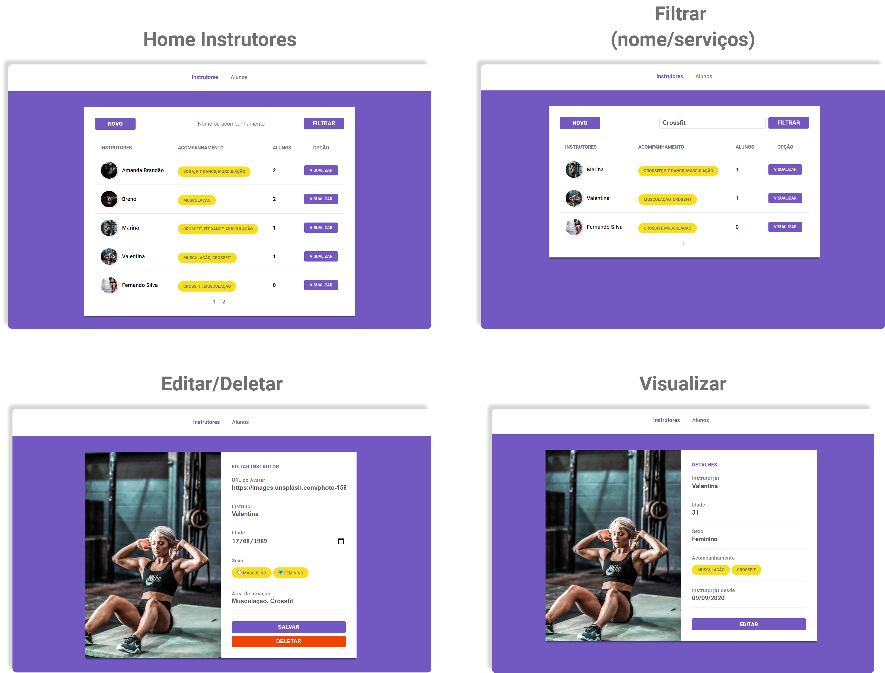
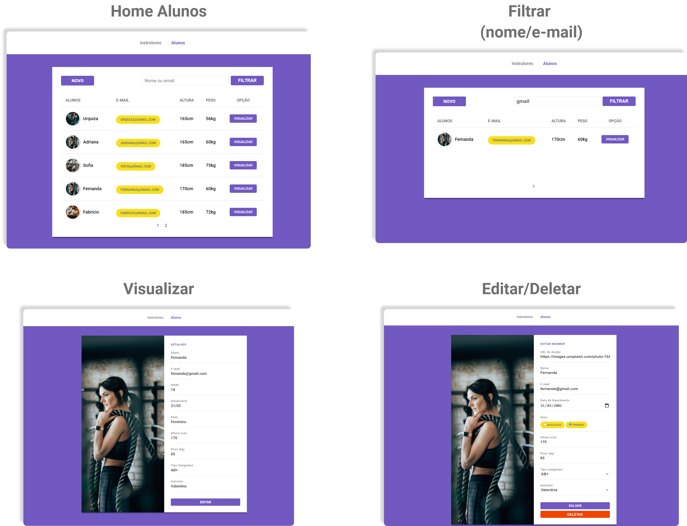

<p align="center" >

<a href="https://www.linkedin.com/in/urquiza-n%C3%B3brega-b999a1105/"></a>
</p>
<h1 align="center">Gym Manager</h1>
<p align="center">Simplificando o gerenciamento dos instrutores e alunos da sua academia.</p>

<h5 align="center"> 🚀 Projeto finalizado 🚀 </h5>

Tabela de conteúdos
=================
<!--ts-->
   * Telas
      * [Web](#telas)
   * [Funcionalidades](#funcionalidades)
   * [Tecnologias utilizadas](#tecnologias-utilizadas)
   * Instalação
      * [Pré requisitos](#pré-requisitos)
      * [Server](#server)
      * [Web](#web)
<!--te-->

## Telas
### Web



## Funcionalidades
- Através do Gym Manager você poderá:
	- Cadastrar instrutores e alunos
	- Editar instrutores e alunos
	- Visualizar instrutores e alunos
	- Excluir instrutores e alunos
  - Filtrar busca de instrutores e alunos

## Tecnologias utilizadas
- [x] HTML
- [x] CSS
- [x] Javascript
- [x] NodeJS
- [x] PostgreSQL
- [x] Express

## Instalação

### Pré-requisitos
Você precisa ter instalado em sua máquina as seguintes ferramentas:
- [Git](https://git-scm.com)
- [Node.js](https://nodejs.org/en/) 
- [PostgreSQL](https://www.postgresql.org/) 

### 🎲 Clonando o repositório

```bash
# Clone este repositório
$ git clone <https://github.com/UrquizaN/controle-academia>

# Acesse a pasta do projeto no terminal/cmd
$ cd controle-academia
```
### 🛑 Configurando o Database 🛑

```bash
# Acesse a pasta src/database
### Editar o db.js com as configurações do seu banco de dados
```
```bash
# Instale as dependências
$ npm install
ou
$ yarn install

# Execute o projeto
$ npm start
ou 
$ yarn start

# O servidor inciará na porta:5000 - acesse <http://localhost:5000>
```
<p  align="center">Projeto <strong>Gym Manager</strong> foi desenvolvido durante o Launchbase da <a  href="https://rocketseat.com.br">Rocketseat</a>. Ministrado por <a href="https://github.com/maykbrito"> Myke Brito </a></p>

<h3 align="center">
💻 Desenvolvido por: Urquiza Nóbrega
</h3>
